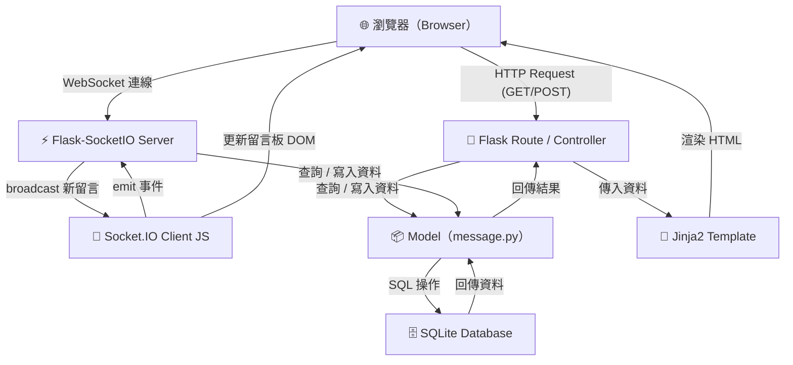
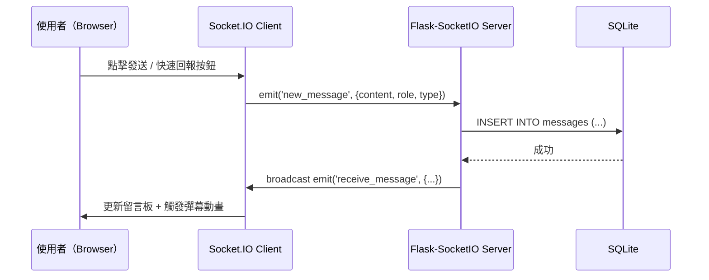
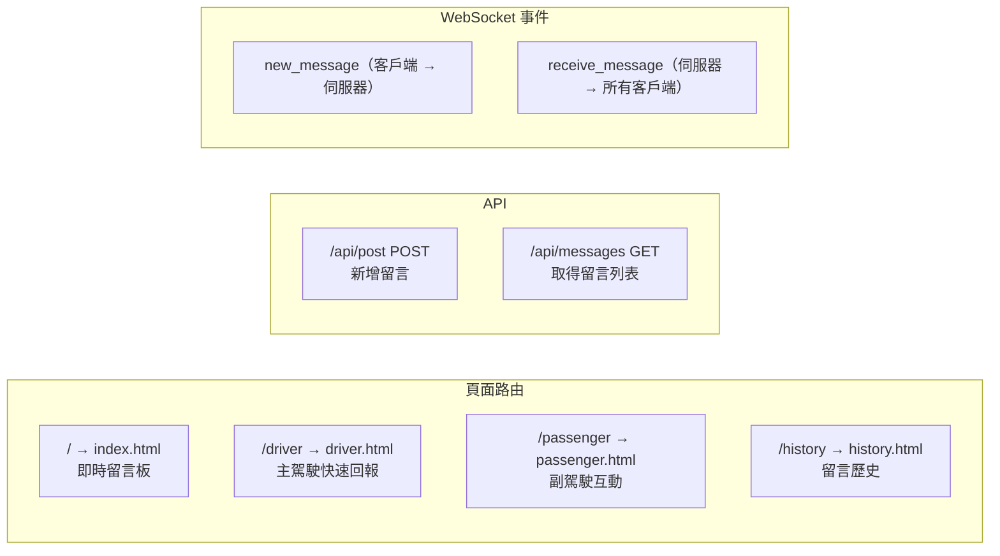

# ARCHITECTURE — 即時路況留言板（Road Bulletin）

> 版本：v1.0　｜　建立日期：2026-05-17　｜　語言：繁體中文

---

## 1. 技術架構說明

### 1.1 選用技術與原因

| 技術 | 版本建議 | 選用原因 |
|------|----------|----------|
| **Python** | 3.10+ | 簡潔易讀，適合快速開發原型 |
| **Flask** | 3.x | 輕量級 Web 框架，路由靈活，適合小型專案 |
| **Flask-SocketIO** | 5.x | 提供 WebSocket 支援，實現即時留言推送 |
| **Jinja2** | 內建於 Flask | 伺服器端模板引擎，直接渲染 HTML，無需前後端分離 |
| **SQLite** | 內建於 Python | 零設定、檔案型資料庫，適合單機或小規模部署 |
| **HTML + CSS + Vanilla JS** | — | 無額外框架依賴，配合 Socket.IO client 即可完成互動 |

### 1.2 Flask MVC 模式說明

本專案採用 **MVC（Model-View-Controller）** 架構：

| 層次 | 資料夾 / 檔案 | 職責 |
|------|---------------|------|
| **Model** | `app/models/` | 定義資料表結構、資料庫 CRUD 操作 |
| **View** | `app/templates/` | Jinja2 HTML 模板，負責頁面呈現 |
| **Controller** | `app/routes/` | Flask 路由，處理 HTTP 請求與 WebSocket 事件，協調 Model 與 View |

---

## 2. 專案資料夾結構

```
google-map/
│
├── app/                        ← 應用程式主套件
│   ├── __init__.py             ← 建立 Flask app 與 SocketIO 實例
│   │
│   ├── models/                 ← Model 層（資料庫模型）
│   │   ├── __init__.py
│   │   └── message.py          ← Message 資料表定義與查詢方法
│   │
│   ├── routes/                 ← Controller 層（Flask 路由）
│   │   ├── __init__.py
│   │   ├── main.py             ← 首頁、歷史頁路由
│   │   ├── driver.py           ← 主駕駛快速回報頁路由
│   │   ├── passenger.py        ← 副駕駛互動頁路由
│   │   └── api.py              ← REST API 路由（/api/post、/api/messages）
│   │
│   ├── templates/              ← View 層（Jinja2 HTML 模板）
│   │   ├── base.html           ← 共用基礎模板（導覽列、樣式引入）
│   │   ├── index.html          ← 首頁 / 留言板
│   │   ├── driver.html         ← 主駕駛快速回報頁
│   │   ├── passenger.html      ← 副駕駛互動頁（含彈幕）
│   │   └── history.html        ← 留言歷史記錄頁
│   │
│   └── static/                 ← 靜態資源
│       ├── css/
│       │   └── style.css       ← 全域樣式（含彈幕動畫）
│       └── js/
│           ├── socket.js       ← Socket.IO 客戶端連線邏輯
│           ├── danmaku.js      ← 彈幕動畫控制
│           └── cooldown.js     ← 快速回報冷卻時間計時器
│
├── instance/
│   └── database.db             ← SQLite 資料庫檔案（自動生成）
│
├── docs/                       ← 文件資料夾
│   ├── PRD.md                  ← 產品需求文件
│   └── ARCHITECTURE.md         ← 本架構文件
│
├── app.py                      ← 應用程式入口（啟動 Flask + SocketIO）
├── config.py                   ← 設定檔（資料庫路徑、Secret Key 等）
├── requirements.txt            ← Python 依賴套件列表
└── README.md                   ← 專案說明
```

---

## 3. 元件關係圖

### 3.1 整體架構流程



### 3.2 留言發送流程



### 3.3 頁面與路由對應



---

## 4. 資料庫設計（概覽）

### messages 資料表

| 欄位名稱 | 資料類型 | 說明 |
|----------|----------|------|
| `id` | INTEGER PRIMARY KEY | 自動遞增主鍵 |
| `content` | TEXT NOT NULL | 留言內容（最多 100 字） |
| `role` | TEXT | 發送者角色（`driver` / `passenger` / `user`） |
| `type` | TEXT | 留言類型（`traffic` / `construction` / `incident` / `police`） |
| `created_at` | DATETIME | 建立時間（預設為當前時間） |

> 資料保留策略：每次查詢自動過濾 24 小時以上的舊留言。

---

## 5. 關鍵設計決策

### 決策 1：使用 WebSocket（Flask-SocketIO）而非輪詢

**選擇**：採用 WebSocket 即時推送，而非每 5 秒 AJAX 輪詢。  
**原因**：WebSocket 連線建立後雙向通訊，伺服器可主動推送新留言，減少不必要的 HTTP 請求，降低延遲，提升即時感。

---

### 決策 2：不做前後端分離，採用 Jinja2 SSR

**選擇**：頁面由 Flask + Jinja2 在伺服器端渲染（Server-Side Rendering）。  
**原因**：專案規模小、開發人員熟悉 Python，SSR 減少複雜度，SEO 友好，且首屏載入更快。

---

### 決策 3：快速回報按鈕冷卻時間由前端 JS 控制

**選擇**：冷卻計時器主要在前端（`cooldown.js`）實作，後端不做強制驗證（MVP 階段）。  
**原因**：降低後端實作複雜度。注意：此設計在 MVP 後應補上後端 Rate Limiting（如 Flask-Limiter）。

---

### 決策 4：SQLite 作為唯一資料庫

**選擇**：使用 SQLite 而非 PostgreSQL / MySQL。  
**原因**：專案為單機或小規模使用，SQLite 無需額外安裝與設定，Python 內建支援，降低部署門檻。

---

### 決策 5：彈幕動畫純 CSS + JS 實作

**選擇**：彈幕效果以 CSS `@keyframes` 水平滾動搭配 JS 動態插入 DOM 實現。  
**原因**：不引入第三方動畫函式庫，維持技術棧精簡，且 CSS 動畫效能優於 JS 計算位移。

---

*本文件由 Antigravity AI Agent 根據 PRD.md 自動產出，請團隊共同審閱並補充細節。*
