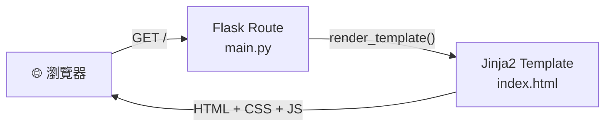
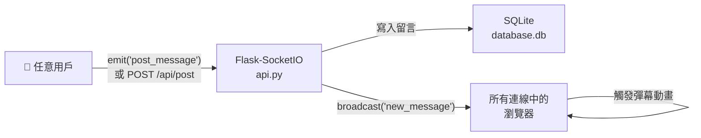
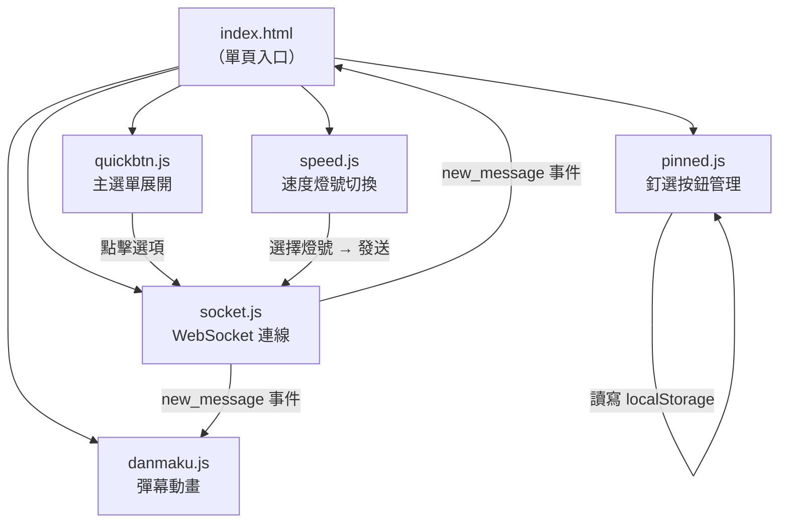

# 系統架構設計文件 — Road Bulletin（即時路況留言板）

> 版本：v1.1　｜　更新日期：2026-05-14　｜　語言：繁體中文

---

## 1. 技術架構說明

### 1.1 選用技術與原因

| 技術 | 版本建議 | 選用原因 |
|------|----------|----------|
| **Python + Flask** | Python 3.11+、Flask 3.x | 輕量級框架，適合中小型專案，路由與模板整合方便 |
| **Jinja2** | 隨 Flask 內建 | Flask 官方模板引擎，直接在 HTML 內嵌入變數與邏輯 |
| **SQLite** | 隨 Python 內建 | 零設定、單一檔案資料庫，適合本地開發與 MVP 階段 |
| **Flask-SocketIO** | 5.x | 提供 WebSocket 雙向通訊，實現留言即時推送與彈幕同步 |
| **Vanilla JS + CSS** | ES6+ | 無需額外框架，彈幕 / 快速按鈕動畫以純 CSS 實作 |
| **模擬地圖背景** | CSS | MVP 階段以深色格線地圖取代真實地圖，無需 API Key |

### 1.2 Flask MVC 模式說明

| 層次 | 對應元件 | 職責 |
|------|----------|------|
| **Model** | `app/models/` | 定義資料表結構、負責與 SQLite 的讀寫操作 |
| **View** | `app/templates/` | Jinja2 HTML 模板，渲染單一頁面給使用者 |
| **Controller** | `app/routes/` | Flask 路由，處理 HTTP / SocketIO 請求、呼叫 Model、交給 View 渲染 |

---

## 2. 專案資料夾結構

```
road-bulletin/                  ← 專案根目錄
│
├── app/                        ← 主應用程式套件
│   ├── __init__.py             ← Flask app 工廠函式，初始化 SocketIO、DB
│   │
│   ├── models/                 ← Model 層：資料庫模型
│   │   ├── __init__.py
│   │   └── message.py          ← Message 資料表定義（留言模型）
│   │
│   ├── routes/                 ← Controller 層：Flask 路由
│   │   ├── __init__.py
│   │   ├── main.py             ← 主頁面路由 `/`
│   │   └── api.py              ← REST API + SocketIO 事件處理
│   │                              /api/post、/api/messages、/api/pinned
│   │
│   ├── templates/              ← View 層：Jinja2 HTML 模板
│   │   └── index.html          ← 唯一頁面（左右分割佈局）
│   │
│   └── static/                 ← 靜態資源
│       ├── css/
│       │   ├── style.css       ← 全域樣式（含左右分割佈局）
│       │   ├── danmaku.css     ← 彈幕動畫樣式
│       │   └── quickbtn.css    ← 快速按鈕 + 展開動畫樣式
│       └── js/
│           ├── socket.js       ← SocketIO 連線與事件處理
│           ├── danmaku.js      ← 彈幕產生與動畫邏輯
│           ├── quickbtn.js     ← 主選單展開 / 收合邏輯
│           ├── pinned.js       ← 釘選按鈕管理（localStorage）
│           └── speed.js        ← 速度燈號狀態管理（手動切換）
│
├── instance/                   ← 執行期資料（不放入版本控制）
│   └── database.db             ← SQLite 資料庫檔案
│
├── docs/                       ← 文件資料夾
│   ├── PRD.md                  ← 產品需求文件
│   ├── ARCHITECTURE.md         ← 本架構文件
│   └── FLOWCHART.md            ← 流程圖文件
│
├── app.py                      ← 應用程式入口，啟動 Flask + SocketIO
├── config.py                   ← 設定檔（資料庫路徑、Secret Key 等）
├── requirements.txt            ← Python 相依套件清單
└── .gitignore                  ← Git 忽略清單（instance/、__pycache__/ 等）
```

---

## 3. 頁面佈局設計

### 3.1 單頁分割佈局

```
┌─────────────────────────────────────────────────────────┐
│                                                         │
│   ◀─────────── 導航畫面（75vw）────────────▶│◀─25vw─▶ │
│                                              │          │
│   深色模擬地圖（CSS grid 格線）              │ 留言板   │
│                                              │          │
│   彈幕訊息橫向滾動覆蓋                       │ 社群式   │
│   ~~前方塞車，請注意！~~                     │ 留言串   │
│   ~~前方有車禍~~                             │          │
│                                              │ 輸入框   │
│   ◉ 主選單   [📌][📌][📌]                   │          │
└──────────────────────────────────────────────┴──────────┘
```

### 3.2 快速按鈕佈局（左下角）

```
  [📌 釘選3]  [📌 釘選2]  [📌 釘選1]  ◉ 主選單
                                         ↑ 點擊展開
                              ┌──────────────────┐
                              │ 🔴 車速 < 30     │
                              │ 🟡 車速 30–60    │
                              │ 🟢 車速 > 60     │
                              │ 🚗💥 前方車禍    │
                              │ 📦⚠️ 前方掉落物  │
                              └──────────────────┘
```

---

## 4. 元件關係圖

### 4.1 HTTP 請求流程



### 4.2 WebSocket 即時推送流程



### 4.3 前端模組關係



### 4.4 路由與 API 對應

```
GET  /               → main.py → index.html   （唯一頁面）
POST /api/post       → api.py                 （新增留言）
GET  /api/messages   → api.py                 （取得留言列表）
GET  /api/pinned     → api.py                 （取得釘選設定）
POST /api/pinned     → api.py                 （更新釘選設定）

SocketIO: post_message  → 接收留言 → 寫 DB → broadcast new_message
SocketIO: new_message   → 廣播給所有用戶
```

---

## 5. 資料庫設計（概覽）

> 詳細欄位設計請見後續的 `DB_DESIGN.md`。

### 主要資料表：`messages`

| 欄位 | 型別 | 說明 |
|------|------|------|
| `id` | INTEGER PRIMARY KEY | 自動遞增主鍵 |
| `content` | TEXT NOT NULL | 留言內容（最多 100 字） |
| `category` | TEXT | 留言類型：speed / accident / debris / other |
| `speed_level` | TEXT | 速度等級：red / yellow / green（僅速度類留言） |
| `created_at` | DATETIME | 發送時間（UTC） |

---

## 6. 關鍵設計決策

### 決策 1：單頁整合，不做多頁面切換

**選擇**：所有功能集中在單一頁面，左側導航、右側留言板、快速按鈕並存。

**原因**：
- 主駕駛行車中不應切換頁面，所有資訊需在同一畫面上取得
- 單頁架構簡化路由，Flask 只需一個主路由 `main.py`
- 前端複雜度集中在 JS 模組，後端保持簡單

---

### 決策 2：速度燈號由駕駛手動點選

**選擇**：🔴🟡🟢 三個燈號不自動偵測，由駕駛依當前時速手動點擊選擇。

**原因**：
- 瀏覽器 Geolocation API 速度偵測在市區或靜止情境下誤差大
- 手動選擇更直覺，駕駛對自己車速最清楚
- 降低隱私授權需求（不需位置權限）

---

### 決策 3：模擬地圖背景（MVP 階段）

**選擇**：左側導航畫面以 CSS 深色格線模擬地圖外觀，不整合外部地圖 API。

**原因**：
- Google Maps API 需申請費用，增加 MVP 複雜度
- 核心功能（留言板 + 彈幕 + 快速按鈕）不依賴真實地圖即可驗證
- 後期可無痛替換為 Google Maps Embed 或 Leaflet.js

---

### 決策 4：釘選按鈕儲存於 localStorage

**選擇**：釘選設定不存入資料庫，儲存於使用者瀏覽器的 `localStorage`。

**原因**：
- 釘選偏好是個人設定，不需要伺服器端同步
- 省去使用者登入系統的複雜度
- localStorage 在同一裝置、同一瀏覽器下永久保留

---

### 決策 5：冷卻機制在前端 + 後端雙層防護

**選擇**：快速回報冷卻時間在前端（`localStorage` 計時）與後端（IP + 時間窗口檢查）雙重實作。

**原因**：
- 前端冷卻提供即時 UI 回饋（按鈕變灰、倒數），改善使用者體驗
- 後端驗證防止用戶繞過前端直接呼叫 API 洗版
- 符合 PRD 的安全需求（60 秒內限發 3 則）

---

*本文件由 Antigravity AI Agent 協助產出，請團隊共同審閱並補充細節。*
