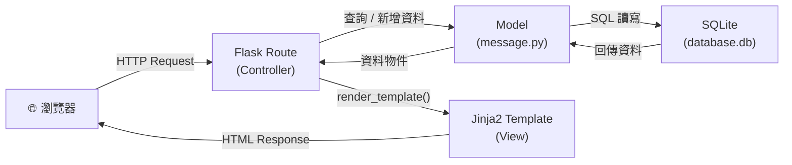
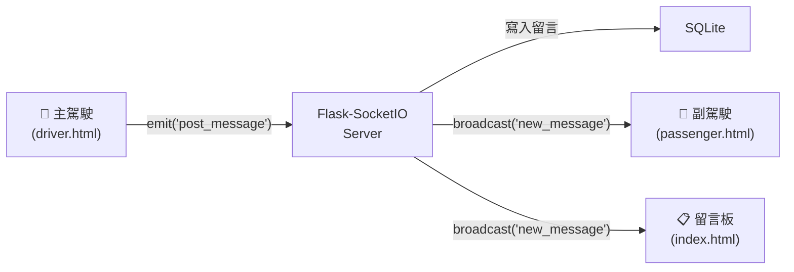

# 系統架構設計文件 — Road Bulletin（即時路況留言板）

> 版本：v1.0　｜　撰寫日期：2026-05-14　｜　語言：繁體中文

---

## 1. 技術架構說明

### 1.1 選用技術與原因

| 技術 | 版本建議 | 選用原因 |
|------|----------|----------|
| **Python + Flask** | Python 3.11+、Flask 3.x | 輕量級框架，適合中小型專案，路由與模板整合方便 |
| **Jinja2** | 隨 Flask 內建 | Flask 官方模板引擎，直接在 HTML 內嵌入變數與邏輯 |
| **SQLite** | 隨 Python 內建 | 零設定、單一檔案資料庫，適合本地開發與 MVP 階段 |
| **Flask-SocketIO** | 5.x | 提供 WebSocket 雙向通訊，實現留言即時推送 |
| **Vanilla JS + CSS** | ES6+ | 無需額外框架，降低學習成本，彈幕動畫以純 CSS 實作 |

### 1.2 Flask MVC 模式說明

本專案採用 **MVC（Model / View / Controller）** 架構：

| 層次 | 對應元件 | 職責 |
|------|----------|------|
| **Model** | `app/models/` | 定義資料表結構、負責與 SQLite 的讀寫操作 |
| **View** | `app/templates/` | Jinja2 HTML 模板，負責呈現頁面給使用者 |
| **Controller** | `app/routes/` | Flask 路由，處理 HTTP 請求、呼叫 Model 取得資料、交給 View 渲染 |

---

## 2. 專案資料夾結構

```
road-bulletin/                  ← 專案根目錄
│
├── app/                        ← 主應用程式套件
│   ├── __init__.py             ← Flask app 工廠函式，初始化 SocketIO、DB
│   │
│   ├── models/                 ← Model 層：資料庫模型
│   │   ├── __init__.py
│   │   └── message.py          ← Message 資料表定義（留言模型）
│   │
│   ├── routes/                 ← Controller 層：Flask 路由
│   │   ├── __init__.py
│   │   ├── main.py             ← 首頁 `/`、歷史頁 `/history`
│   │   ├── driver.py           ← 主駕駛頁 `/driver`
│   │   ├── passenger.py        ← 副駕駛頁 `/passenger`
│   │   └── api.py              ← REST API `/api/post`、`/api/messages`
│   │
│   ├── templates/              ← View 層：Jinja2 HTML 模板
│   │   ├── base.html           ← 共用基底版型（導覽列、Head）
│   │   ├── index.html          ← 首頁留言板
│   │   ├── driver.html         ← 主駕駛快速回報頁
│   │   ├── passenger.html      ← 副駕駛互動 + 彈幕頁
│   │   └── history.html        ← 留言歷史記錄頁
│   │
│   └── static/                 ← 靜態資源
│       ├── css/
│       │   ├── style.css       ← 全域樣式
│       │   └── danmaku.css     ← 彈幕動畫樣式
│       └── js/
│           ├── socket.js       ← SocketIO 連線與事件處理
│           ├── danmaku.js      ← 彈幕產生與動畫邏輯
│           └── cooldown.js     ← 快速回報冷卻時間機制
│
├── instance/                   ← 執行期資料（不放入版本控制）
│   └── database.db             ← SQLite 資料庫檔案
│
├── docs/                       ← 文件資料夾
│   ├── PRD.md                  ← 產品需求文件
│   └── ARCHITECTURE.md         ← 本架構文件
│
├── app.py                      ← 應用程式入口，啟動 Flask + SocketIO
├── config.py                   ← 設定檔（資料庫路徑、Secret Key 等）
├── requirements.txt            ← Python 相依套件清單
└── .gitignore                  ← Git 忽略清單（instance/、__pycache__/ 等）
```

---

## 3. 元件關係圖

### 3.1 HTTP 請求流程



### 3.2 WebSocket 即時推送流程



### 3.3 頁面與路由對應

```
/ ─────────────── main.py → index.html        （留言板首頁）
/driver ──────── driver.py → driver.html       （主駕駛快速回報）
/passenger ───── passenger.py → passenger.html （副駕駛互動頁）
/history ──────── main.py → history.html       （留言歷史記錄）
/api/post ─────── api.py                       （POST：新增留言）
/api/messages ─── api.py                       （GET：取得留言列表）
```

---

## 4. 資料庫設計（概覽）

> 詳細欄位設計請見後續的 `DB_DESIGN.md`。

### 主要資料表：`messages`

| 欄位 | 型別 | 說明 |
|------|------|------|
| `id` | INTEGER PRIMARY KEY | 自動遞增主鍵 |
| `content` | TEXT NOT NULL | 留言內容（最多 100 字） |
| `role` | TEXT | 發送者角色：`driver` / `passenger` |
| `category` | TEXT | 留言類型：塞車 / 施工 / 突發 / 測速 |
| `created_at` | DATETIME | 發送時間（UTC） |

---

## 5. 關鍵設計決策

### 決策 1：使用 Flask-SocketIO 取代輪詢

**選擇**：使用 WebSocket（Flask-SocketIO）即時推送，而非每 5 秒 AJAX 輪詢。

**原因**：
- 輪詢會造成大量無效請求，WebSocket 只在有新留言時才傳輸
- 實現真正「即時」的體驗，留言發送後所有用戶幾乎同步看到
- Flask-SocketIO 與 Flask 整合簡單，初學者也容易上手

---

### 決策 2：不做使用者登入，改以角色選擇區分

**選擇**：使用者進入頁面時選擇身份（主駕駛 / 副駕駛），不需帳號。

**原因**：
- 降低使用門檻，符合「行車中快速使用」的核心情境
- MVP 階段不需複雜的 Session 管理
- 角色資訊只儲存於 `localStorage`，不需後端驗證

---

### 決策 3：彈幕動畫以純 CSS 實作

**選擇**：彈幕效果使用 CSS `@keyframes` + `animation` 水平滾動，不依賴動畫函式庫。

**原因**：
- 效能佳，CSS 動畫由瀏覽器 GPU 加速
- 無額外相依套件
- 動畫參數（速度、高度）可輕易透過 CSS 變數調整

---

### 決策 4：SQLite 搭配 24 小時自動清理

**選擇**：資料庫只保留最近 24 小時的留言。

**原因**：
- 路況留言具有強烈時效性，超過 24 小時的資料幾乎無參考價值
- 防止資料庫無限成長，維持查詢效能
- 清理邏輯可透過 Flask 定時任務（或每次查詢時過濾）實作

---

### 決策 5：冷卻機制在前端 + 後端雙層防護

**選擇**：快速回報冷卻時間同時在前端（`localStorage` 計時）與後端（IP + 時間窗口檢查）實作。

**原因**：
- 前端冷卻提供即時 UI 回饋（按鈕變灰、倒數顯示），改善使用者體驗
- 後端驗證防止用戶繞過前端直接呼叫 API 洗版
- 雙層防護符合 PRD 的安全需求（60 秒內限發 3 則）

---

*本文件由 Antigravity AI Agent 協助產出，請團隊共同審閱並補充細節。*
