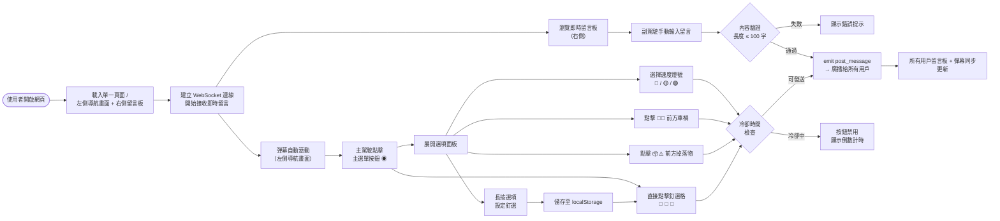
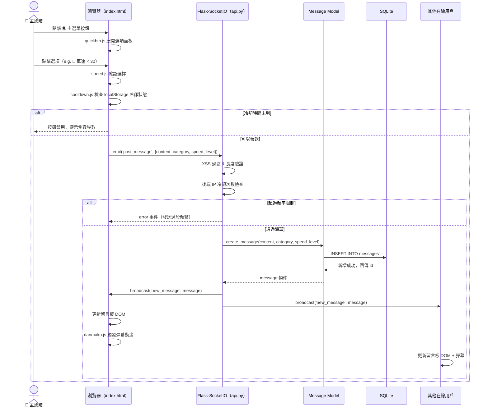
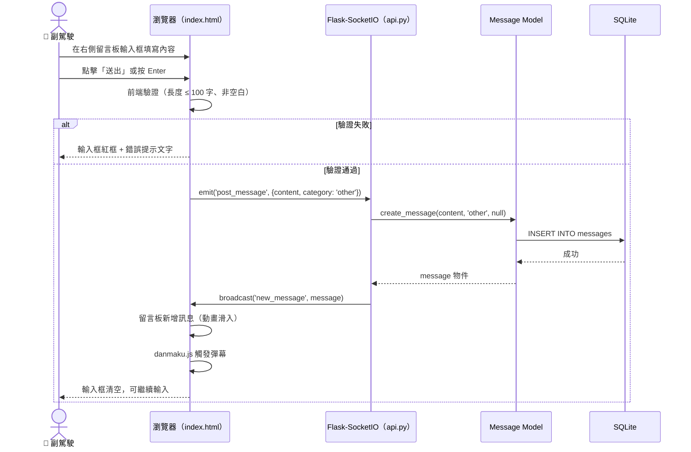
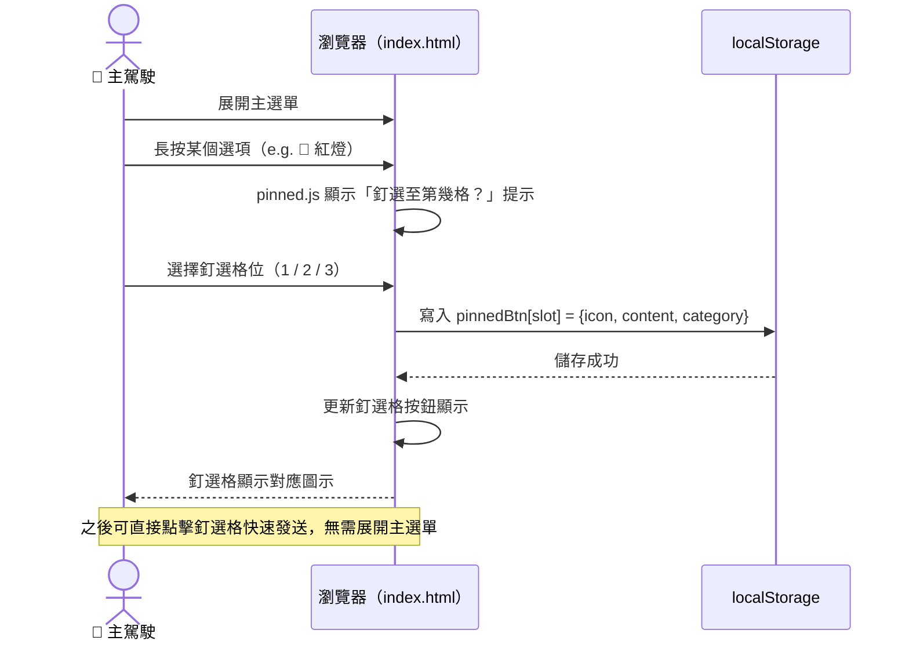
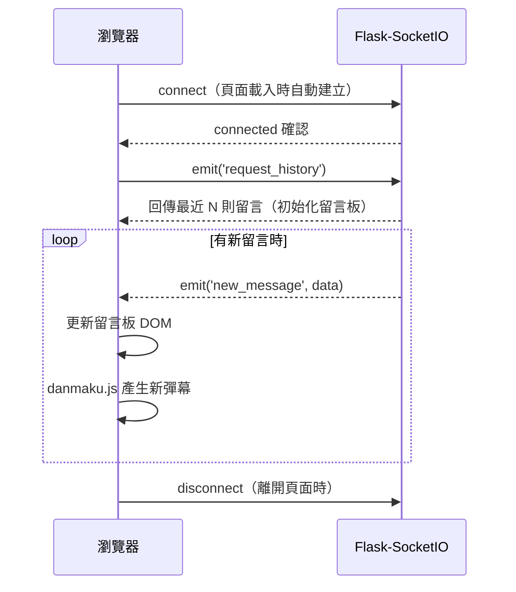
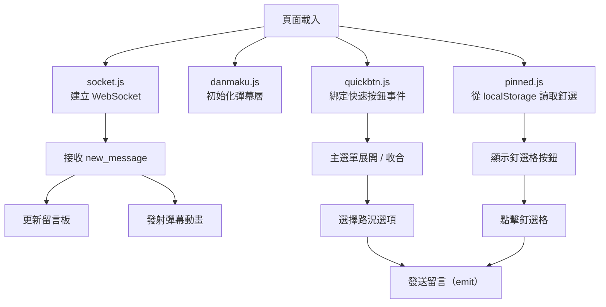

# 流程圖設計文件 — Road Bulletin（即時路況留言板）

> 版本：v1.1　｜　更新日期：2026-05-14　｜　語言：繁體中文

---

## 1. 使用者流程圖（User Flow）

所有操作在單一頁面內完成，不涉及頁面切換。

---

## 2. 系統序列圖（Sequence Diagram）

### 2.1 主駕駛快速回報（主選單按鈕）

### 2.2 副駕駛手動輸入留言

### 2.3 釘選按鈕設定流程

### 2.4 WebSocket 連線建立

---

## 3. 功能清單對照表

| 功能 | 路徑 | HTTP 方法 / 事件 | 說明 |
|------|------|-----------------|------|
| 載入主頁面 | `/` | GET | 唯一頁面，含導航 + 留言板 + 快速按鈕 |
| 新增留言 | `/api/post` | POST | REST 備用端點（主要走 SocketIO） |
| 取得留言列表 | `/api/messages` | GET | 回傳 JSON，支援 `?category=` 篩選 |
| 取得釘選設定 | `/api/pinned` | GET | 回傳使用者釘選按鈕設定 |
| 更新釘選設定 | `/api/pinned` | POST | 更新釘選按鈕配置 |
| 發送留言 | `post_message` | SocketIO emit | 用戶發送留言觸發廣播 |
| 接收留言 | `new_message` | SocketIO broadcast | 伺服器推播新留言給所有用戶 |
| 請求歷史 | `request_history` | SocketIO emit | 頁面載入時取得初始留言 |

---

## 4. 單頁元件狀態流

---

*本文件由 Antigravity AI Agent 協助產出，請團隊共同審閱並補充細節。*
