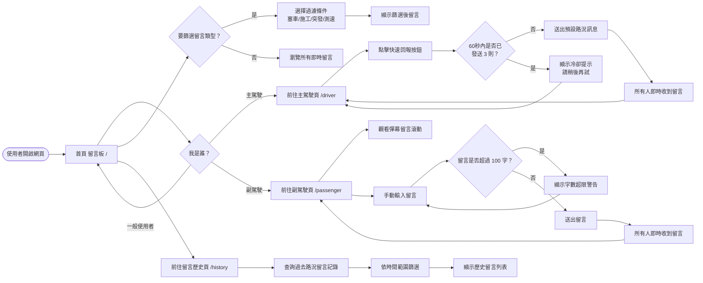
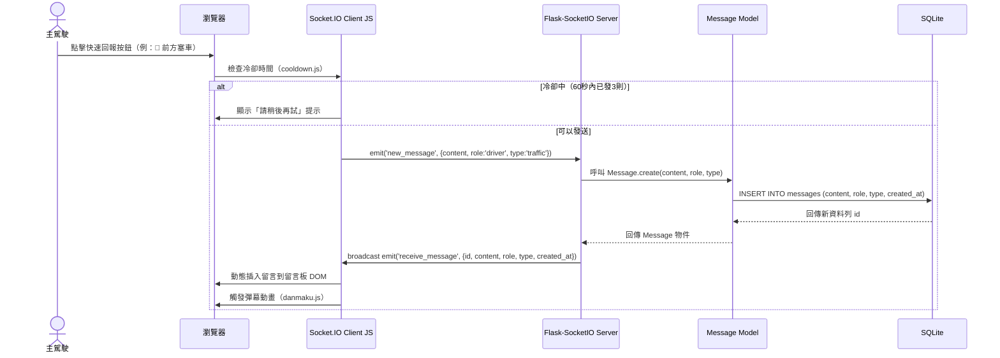
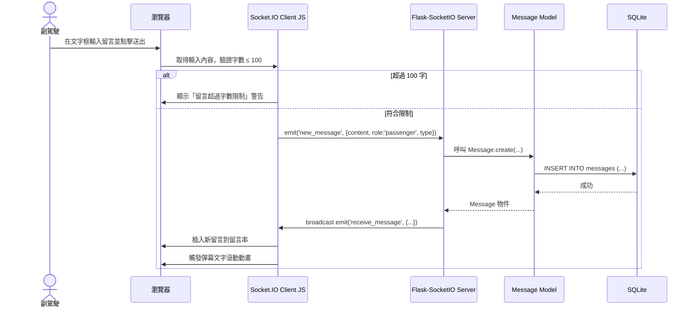
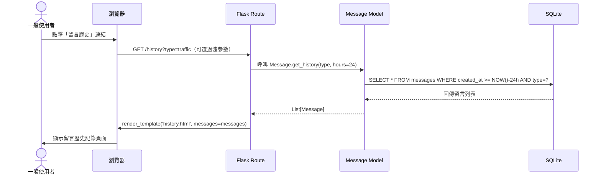
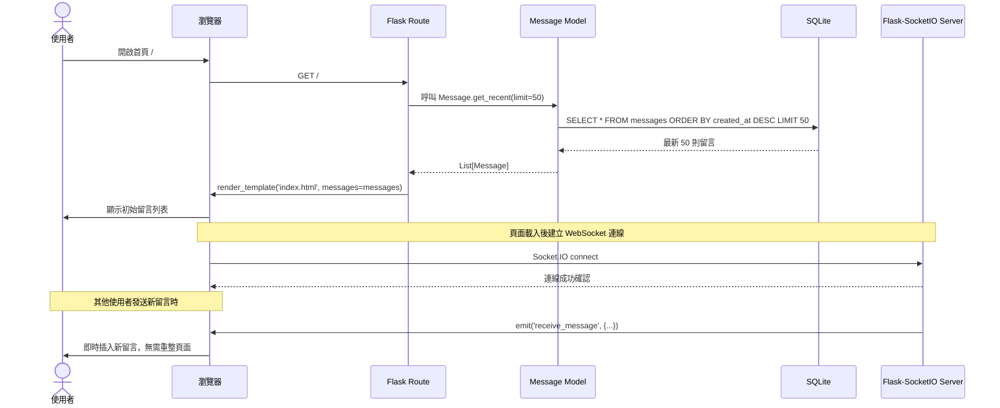

# FLOWCHART — 即時路況留言板（Road Bulletin）

> 版本：v1.0　｜　建立日期：2026-05-17　｜　語言：繁體中文

---

## 1. 使用者流程圖（User Flow）

描述三種使用者角色（主駕駛、副駕駛、一般使用者）進入系統後的完整操作路徑。

---

## 2. 系統序列圖（System Sequence Diagram）

### 2.1 快速回報按鈕發送流程（主駕駛）

---

### 2.2 副駕駛手動輸入留言流程

---

### 2.3 一般使用者查詢留言歷史流程

---

### 2.4 首頁即時留言板載入流程

---

## 3. 功能清單對照表

| 功能名稱 | URL 路徑 | HTTP 方法 / WS 事件 | 對應角色 | 說明 |
|----------|----------|----------------------|----------|------|
| 首頁留言板 | `/` | `GET` | 全體使用者 | 顯示最新即時路況留言 |
| 主駕駛快速回報頁 | `/driver` | `GET` | 主駕駛 | 一鍵快速回報按鈕介面 |
| 副駕駛互動頁 | `/passenger` | `GET` | 副駕駛 | 手動輸入留言 + 彈幕顯示 |
| 留言歷史頁 | `/history` | `GET` | 一般使用者 | 查詢過去路況留言記錄 |
| 新增留言 API | `/api/post` | `POST` | 全體使用者 | REST API 方式新增留言 |
| 取得留言列表 API | `/api/messages` | `GET` | 全體使用者 | 取得最新留言列表（JSON） |
| 發送留言（即時） | — | `WS emit: new_message` | 全體使用者 | WebSocket 方式發送留言 |
| 接收留言（即時） | — | `WS emit: receive_message` | 全體使用者 | 伺服器廣播新留言給所有客戶端 |

---

## 4. 角色權限對照

| 功能 | 主駕駛 | 副駕駛 | 一般使用者 |
|------|:------:|:------:|:----------:|
| 瀏覽即時留言板 | ✅ | ✅ | ✅ |
| 一鍵快速回報 | ✅ | ❌ | ❌ |
| 手動輸入留言 | ❌ | ✅ | ❌ |
| 彈幕留言顯示 | ❌ | ✅ | ❌ |
| 查詢歷史留言 | ✅ | ✅ | ✅ |
| 留言類型過濾 | ✅ | ✅ | ✅ |

---

*本文件由 Antigravity AI Agent 根據 PRD.md 與 ARCHITECTURE.md 自動產出，請團隊共同審閱並補充細節。*
