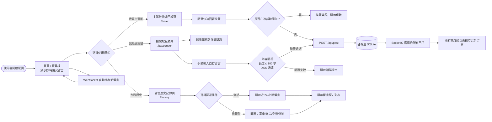
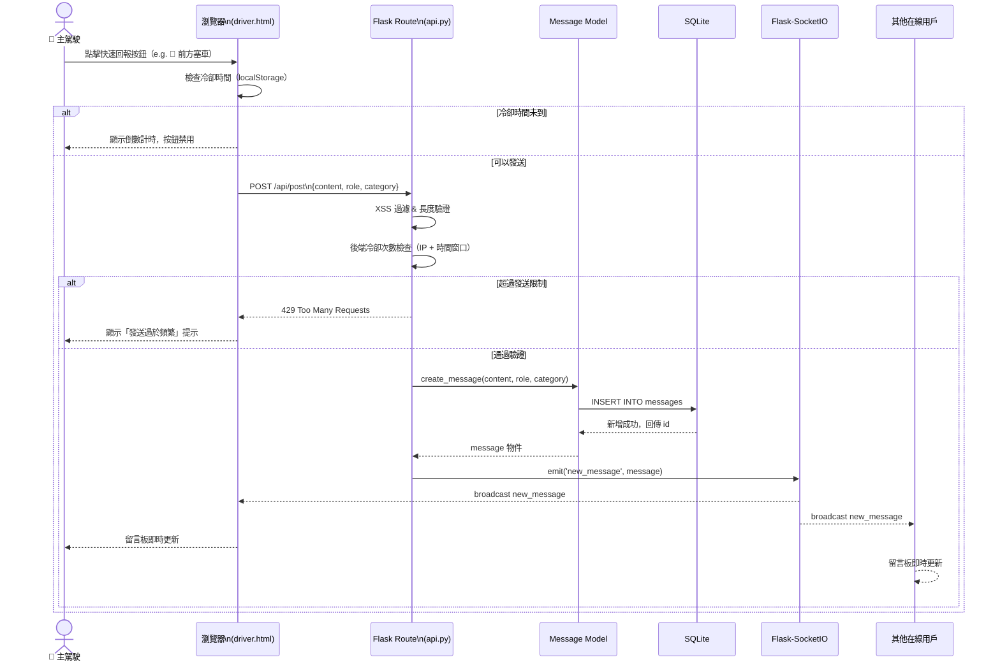
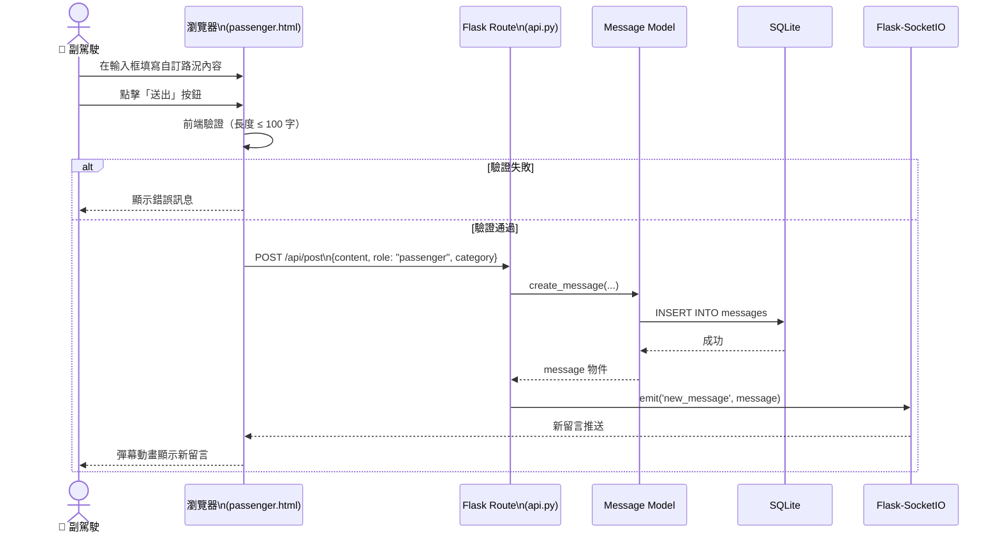
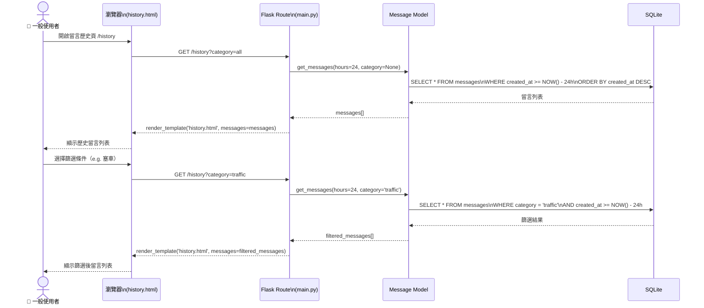
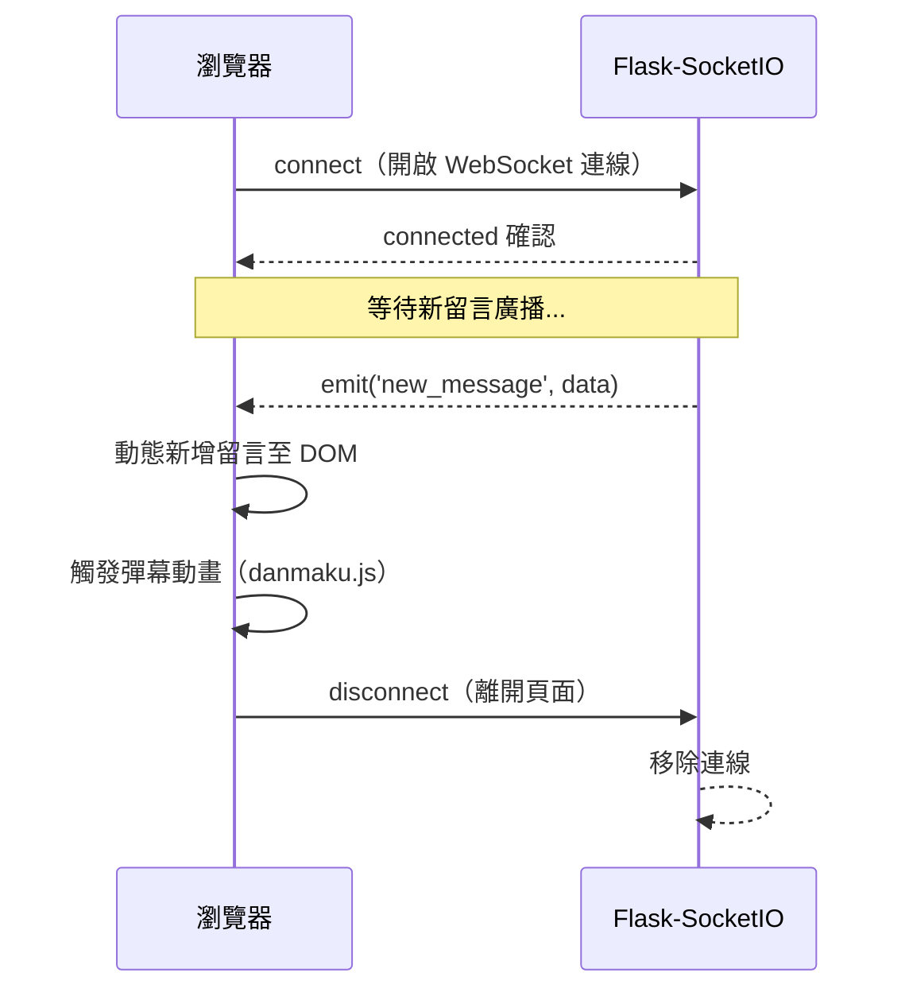
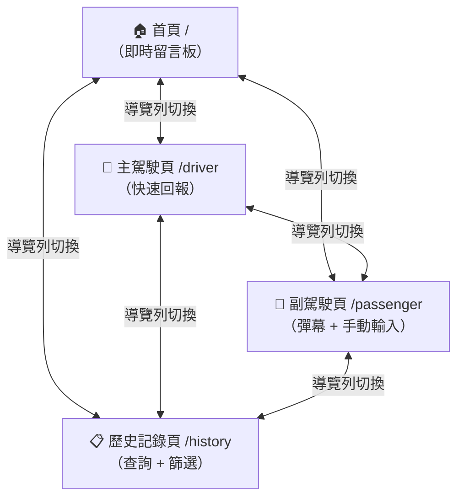

# 流程圖設計文件 — Road Bulletin（即時路況留言板）

> 版本：v1.0　｜　撰寫日期：2026-05-14　｜　語言：繁體中文

---

## 1. 使用者流程圖（User Flow）

描述三種角色（主駕駛、副駕駛、一般使用者）進入系統後的完整操作路徑。

---

## 2. 系統序列圖（Sequence Diagram）

### 2.1 快速回報留言（主駕駛）

描述主駕駛點擊快速按鈕，留言即時廣播給所有在線用戶的完整流程。

### 2.2 副駕駛手動輸入留言

### 2.3 查詢留言歷史（一般使用者）

### 2.4 WebSocket 連線建立（首頁 / 副駕駛頁）

---

## 3. 功能清單對照表

| 功能 | 頁面 / 路徑 | HTTP 方法 | 說明 |
|------|------------|-----------|------|
| 瀏覽即時留言板 | `/` | GET | 首頁顯示最新路況留言，WebSocket 自動更新 |
| 主駕駛快速回報 | `/driver` | GET | 一鍵快速回報頁面，顯示預設按鈕 |
| 副駕駛互動頁 | `/passenger` | GET | 手動輸入留言 + 彈幕動畫頁面 |
| 留言歷史記錄 | `/history` | GET | 顯示近 24 小時留言，支援類型篩選 |
| 新增留言 API | `/api/post` | POST | 接收留言內容，儲存 DB 並廣播 |
| 取得留言列表 API | `/api/messages` | GET | 回傳 JSON 格式留言列表（含篩選參數） |

---

## 4. 頁面轉換關係

---

*本文件由 Antigravity AI Agent 協助產出，請團隊共同審閱並補充細節。*
